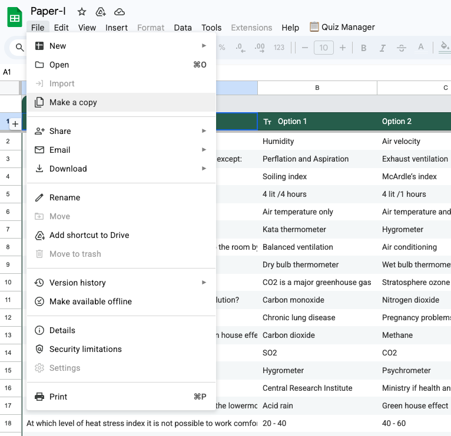
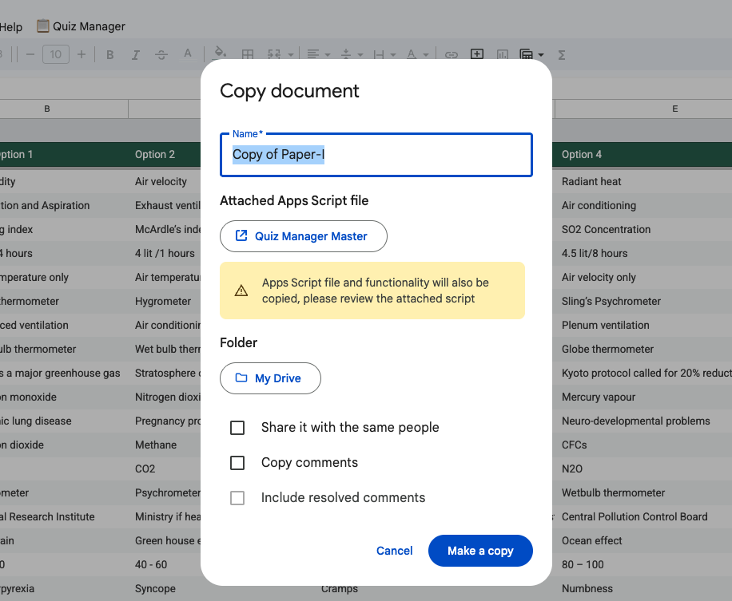
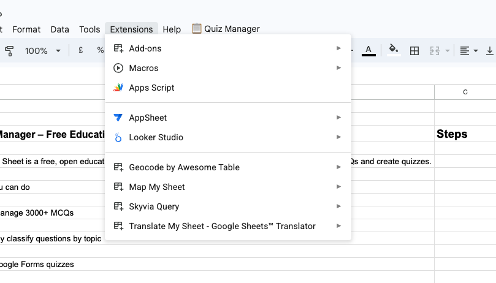
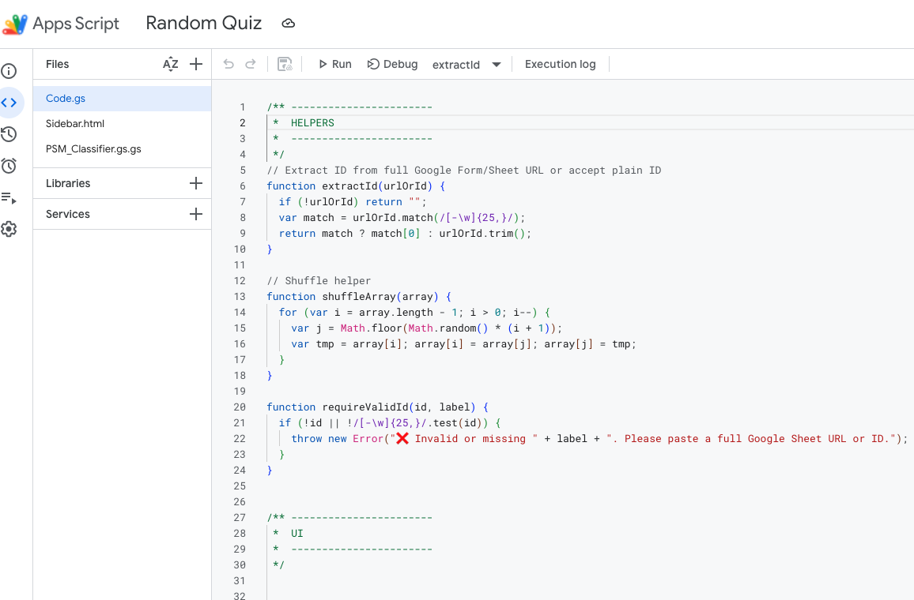
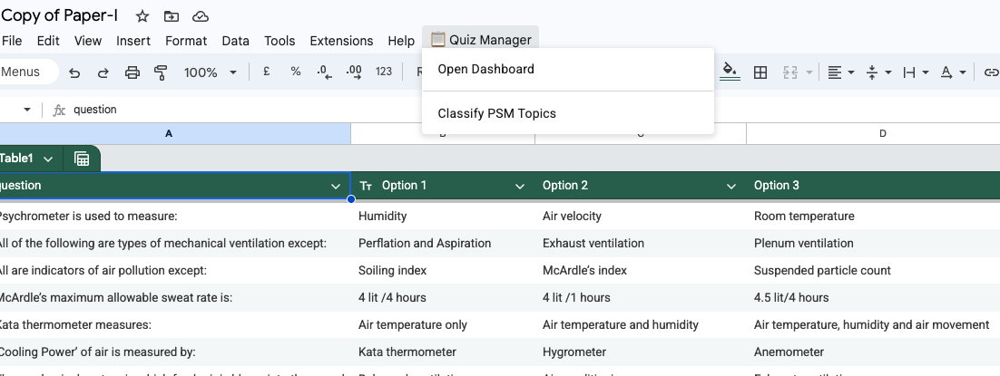
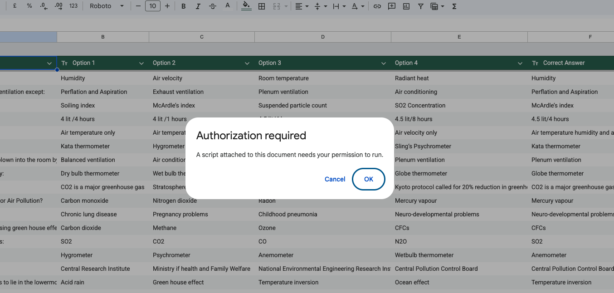
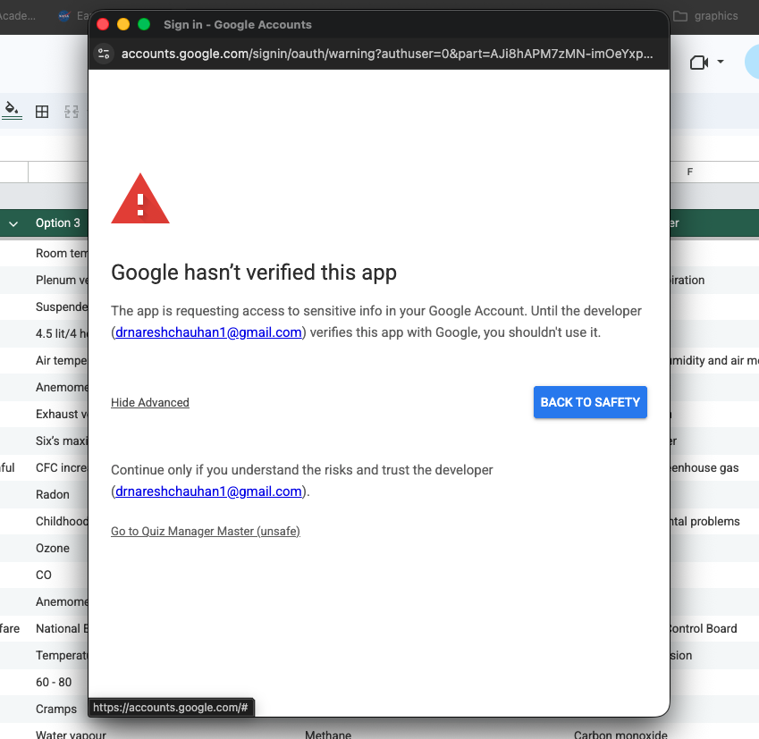
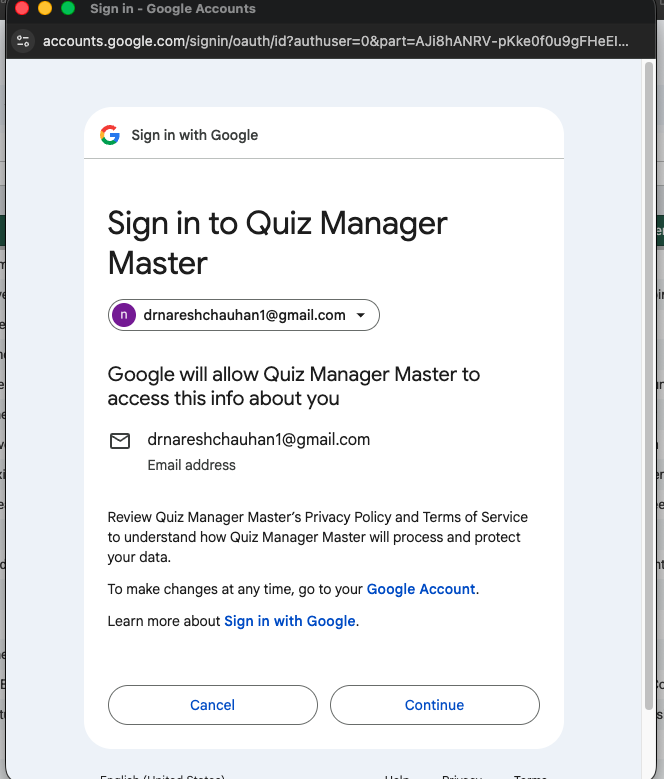
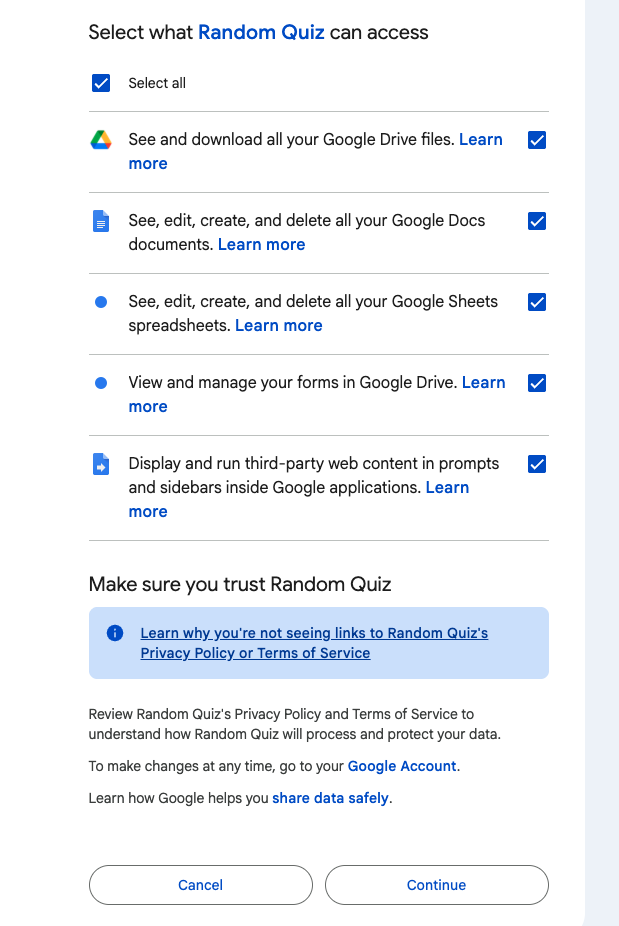
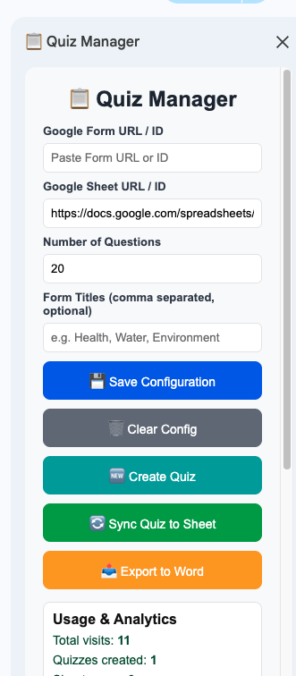

I built a free educational app — and you can run it in your own Google Drive.
I’m sharing a free Google Sheet–based app that helps schools, colleges, and universities manage 3000+ MCQs with ease. (paper-1 & 2 separately)
✔ Auto-organises MCQs by topic
 ✔ Generates quizzes & question papers
✔ Import your existing Google quiz (by just pasting the link)
 ✔ Works entirely inside your own Google Drive
 ✔ No installs. No subscriptions. No data sharing.
You simply:
 👉 Make a copy of the sheet
 👉 Run it in your own Drive & authorise the script
 👉 Start using it
It’s discipline-agnostic and can be used by any school, college, or university.
Why free?
Because good academic tools should be accessible to everyone.
👇 The sheet link is:(also in the comment & the GitHub version if you prefer). 
Click the link, ask for permission, and I will share it with you so you can run it on your own copy.
Paper-I: https://lnkd.in/dDWEGTUr
Paper-II:
https://lnkd.in/duS9-YAT

Let’s make assessment simpler, smarter, and open for all.
🛠 How to Install (Step-by-Step)

This tool runs entirely inside Google Sheets using Google Apps Script.
No software installation is required.

✅ Step 1: Make a Copy of the Sheet

Open the shared Google Sheet link

Click File → Make a copy

Save it in your own Google Drive

⚠️ The tool will NOT work unless you make a copy.

✅ Step 2: Open Apps Script Editor

In your copied Sheet, go to:

Extensions → Apps Script

This opens the Apps Script editor in a new tab

✅ Step 3: Add the Script Code

In the Apps Script editor:

Open Code.gs

Delete any existing code

Open Code.gs from this GitHub repository

Copy all the code

Paste it into the Apps Script editor

Click Save 💾

✅ Step 4: Add the Sidebar HTML

In Apps Script, click ➕ (Add file) → HTML

Name the file:

Sidebar

Open Sidebar.html from this GitHub repository

Copy all content

Paste into the new HTML file

Click Save

✅ Step 5: Reload the Google Sheet

Close the Apps Script tab

Go back to your Google Sheet

Reload the page

After reload, you should see a new menu:

📋 Quiz Manager

✅ Step 6: Open the Dashboard

Click:

📋 Quiz Manager → Open Dashboard

🔐 Permissions (First Time Only)

The first time you run an action:

Google will ask for permissions

Click Advanced

Click Go to project

Allow permissions

This is required because the app:

creates Google Forms

reads/writes Google Sheets

exports documents

The sidebar will open on the right

You’re now ready to use the app 🎉

🔒 Privacy & Safety

All data stays in your Google Drive

No external servers are used

No data is shared with the developer

You remain in full control

❓ Troubleshooting

Menu not visible?

Reload the Sheet once

Error: Invalid Sheet ID?

Paste a full Google Sheet URL or ID in settings

App not working for shared users?

Each user must make their own copy

🎓 Intended Use

This tool is free for:

Schools

Colleges

Universities

Faculty

Students

You are encouraged to adapt and share it.
